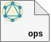
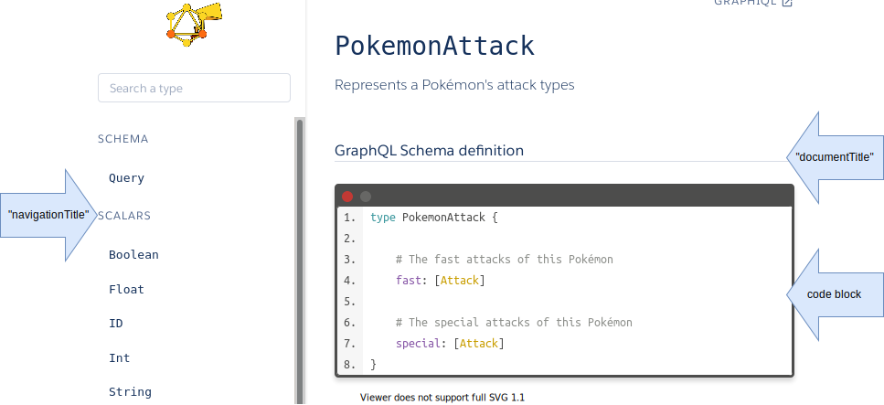

<p align="center">
  <br/>
  <a href="https://graphdoc-plugins.github.io"></a>
</p>

<h1 align="center">GraphQL documentation using graphdoc with Isolated Operations</h1>

[](https://graphdoc-plugins.github.io)
[](https://www.npmjs.com/package/graphdoc-plugin-operations)
[](https://www.npmjs.com/package/graphdoc-plugin-operations)
[](LICENSE.txt)
[](https://gmullerb.gitlab.io/graphdoc-plugin-operations/tests/tests_report.html)
[](https://gmullerb.gitlab.io/graphdoc-plugin-operations/coverage/index.html)
[](https://github.com/gmullerb/graphdoc-plugin-operations)
[](https://gitlab.com/gmullerb/graphdoc-plugin-operations)
__________________

## Quick Start

1 . Add dependencies:

`package.json`:

```json
  ..
  "devDependencies": {
    "@2fd/graphdoc": "2.4.0",
    "graphdoc-plugin-operations": "1.0.0",
    ..
```

2 . If default options are not suitable, then configure `graphdoc-plugin-operations`:

`package.json`:

```json
{
  "graphdoc-plugin-operations": {
    "documentTitle": "The Description",
    "navigationTitle": "The Operations",
    "extractDescription": false,
    "enableAssets": false
  }
}
```

3 Use `graphdoc-plugin-operations`:

`package.json`:

```sh
  graphdoc -p graphdoc/../../graphdoc-plugin-operations -s ./schema.GraphQL -o ./build/documentation
```

> `graphdoc/../../` this is required to get external plugins working in `graphdoc`.
__________________

## Goals

`graphdoc-plugin-operations` provides a way document operations independently using [`graphdoc`](https://www.npmjs.com/package/@2fd/graphdoc).

## Options

`package.json`:

(*default values*)


```json
{
  "graphdoc-plugin-operations": {
    "documentTitle": "Description",
    "navigationTitle": "Operations",
    "extractDescription": true,
    "enableAssets": true
  }
}
```

* `documentTitle`: title of the document section.
* `navigationTitle`: title of the operations section in the navigation.
* `extractDescription`: if set to `false`, then description of the operation will be inside the "code block".
  * Extracted description is render in a `div` with `class="x-desc"`.
* `enableAssets`: if set to `false`, then it will disable all the assets provided by the plugin, i.e. script and css files will not be included.

The following shows where `documentTitle`, `navigationTitle` and "code block" are located, using the example created by [`graphdoc`](https://www.npmjs.com/package/@2fd/graphdoc), [Pokemon GraphQL](https://2fd.github.io/graphdoc/pokemon/pokemonattack.doc.html):



## Tips

* To use `graphdoc-plugin-operations` is necessary that `document-schema` plugin is disabled, use [`graphdoc-plugin-flexible`](https://graphdoc-plugins.github.io) plugin:

`package.json`

```json
  "devDependencies": {
    "@2fd/graphdoc": "2.4.0",
    "graphdoc-plugin-flexible": "1.0.0",
    ..
  },
  "graphdoc-plugin-flexible": {
    "document.schema": { "disable": true }
  }
```

* You can use [`graphdoc-plugin-schema`](https://graphdoc-plugins.github.io) plugin as an alternative to  `document-schema` plugin.

* `main.mustache` template may need some changes in other to get a better view, e.g.:

```
    {{#type}}
      {{^type.methodName}}<p class="slds-text-title--caps slds-text-color--weak">{{type.kind}}</p>{{/type.methodName}}
      {{#type.methodName}}<p class="slds-text-title--caps slds-text-color--weak">Operation</p>{{/type.methodName}}
    {{/type}}
```

* When using `extractDescription: true`, you may want to remove `{{{description}}}` in `main.mustache` template in "title" section.

__________________

## Prerequisites

* [`"@2fd/graphdoc": "2.4.0"`](https://www.npmjs.com/package/@2fd/graphdoc/v/2.4.0).
* [`"marked": "*"`](https://www.npmjs.com/package/marked).

> graphdoc can work with older versions of GraphQL (description syntax: #), and new versions (description syntax: """), [How to configure graphdoc](https://graphdoc-plugins.github.io/docs/how-to-configure-graphdoc.html).  
> `marked` is installed when `@2fd/graphdoc` is installed although a newer version can be used.
__________________

## Contributing

* **Use it**.
* **Share it**.
* [Give it a Star](https://github.com/gmullerb/eslint-plugin-regex).
* [Propose changes or improvements](https://github.com/gmullerb/eslint-plugin-regex/issues).
* [Report bugs](https://github.com/gmullerb/eslint-plugin-regex/issues).

## License

[MIT License](LICENSE.txt)
__________________

## Remember

* Use code style verification tools => Encourages Best Practices, Efficiency, Readability and Learnability.
* Code Review everything => Encourages Functional suitability, Performance Efficiency and Teamwork.
* If viable, Start testing early => Encourages Reliability and Maintainability.

## Additional words

Don't forget:

* **Love what you do**.
* **Learn everyday**.
* **Learn yourself**.
* **Share your knowledge**.
* **Think different!**.
* **Learn from the past, dream on the future, live and enjoy the present to the max!**.
* **Enjoy and Value the Quest** (It's where you learn and grow).

At life:

* Let's act, not complain.
* Be flexible.

At work:

* Let's give solutions, not questions.
* Aim to simplicity not intellectualism.
